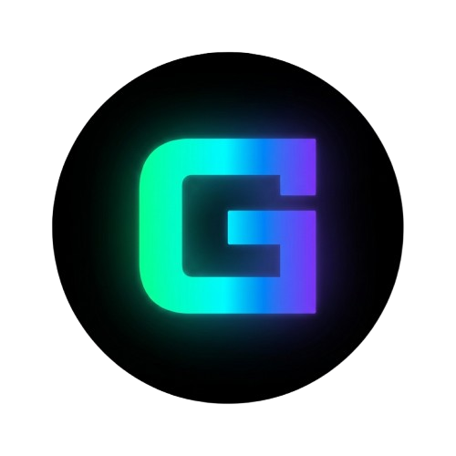

<div align="center">
  
  <h1>GK Engine Suite</h1>
  <p><strong>Lightweight. Powerful. Yours.</strong></p>

  
  
  
  
  
  
  
</div>

---

## 📦 What is GK Engine Suite?

**GK Engine Suite**는 Unity Hub + Unity Editor 구조에서 영감을 받은 경량 게임 엔진 개발 환경입니다. RAM 8GB / GPU 1GB 이상이면 쾌적하게 동작하도록 설계되었습니다.

| 구성 요소 | 언어 | 역할 |
|---|---|---|
| **GK_Hub.exe** | C++ / RmlUi / SDL2 | 프로젝트 & 엔진 버전 관리 허브 |
| **GK_Engine_Core.dll** | C++ / OpenGL 3.3 | 렌더러 · ECS · 씬 · 에셋 임포트 |
| **GK_Engine.exe** | C# / Avalonia / .NET 8 | 편집기 UI (P/Invoke로 Core 호출) |

---

## 🗂️ 레포 구조

```
GKEngine/
├── .github/workflows/build.yml     ← CI/CD (Core DLL → UI → Hub → ZIP)
├── GKHub/
│   ├── CMakeLists.txt
│   ├── src/                        ← C++ Hub 소스
│   │   ├── Common.h                ★ GK_MANIFEST_URL 위치
│   │   ├── HubApp.h/.cpp
│   │   ├── ProjectManager.h/.cpp
│   │   ├── VersionManager.h/.cpp
│   │   ├── SettingsManager.h/.cpp
│   │   ├── I18n.h/.cpp
│   │   ├── ThemeManager.h/.cpp
│   │   ├── TrayIcon.h
│   │   ├── SplashScreen.h
│   │   ├── RmlBackend.h
│   │   └── EventHandler.h
│   └── assets/ui/                  ← RmlUi .rml / .rcss
│       ├── index.rml
│       ├── style.rcss
│       ├── theme-dark.rcss
│       └── theme-light.rcss
├── GKEngine/
│   ├── Core/                       ← C++ 렌더러·ECS (DLL)
│   │   ├── CMakeLists.txt
│   │   ├── include/GKEngineAPI.h   ★ C ↔ C# 계약 헤더
│   │   └── src/
│   │       ├── GKEngineAPI.cpp
│   │       ├── Engine.h/.cpp
│   │       ├── ECS/Entity.h
│   │       ├── Renderer/Renderer.h/.cpp
│   │       ├── Scene/Scene.h/.cpp
│   │       └── Input/Input.h/.cpp
│   └── UI/                         ← C# Avalonia 편집기
│       ├── GKEngine.UI.csproj
│       ├── Program.cs
│       ├── App.axaml/.cs
│       ├── Interop/NativeEngine.cs ★ P/Invoke 선언
│       ├── Services/EngineService.cs
│       ├── ViewModels/EditorViewModel.cs
│       └── Views/
│           ├── EditorWindow.axaml/.cs
│           ├── SceneViewport.axaml/.cs
│           ├── HierarchyPanelView.axaml
│           ├── InspectorPanelView.axaml
│           ├── BottomPanelView.axaml/.cs
│           ├── ToolbarView.axaml
│           ├── MenuBarView.axaml
│           ├── DetachablePanelView.axaml/.cs
│           ├── ComponentBlockView.axaml/.cs
│           └── StatusBarView.axaml
├── docs/
│   ├── BUILD.md                    ← 빌드 가이드
│   └── ARCHITECTURE.md             ← 아키텍처 설명서
└── versions.json                   ← 버전 manifest (Hub가 fetch)
```

---

## ⚡ 빠른 시작

```powershell
git clone https://github.com/reders0412-rgb/GKEngine.git
cd GKEngine

# 1. C++ Core DLL 빌드
cmake -B build/core GKEngine/Core -G "Visual Studio 17 2022" -A x64
cmake --build build/core --config Release

# 2. C# UI 빌드
Copy-Item build/core/Release/GK_Engine_Core.dll GKEngine/UI/
dotnet publish GKEngine/UI/GKEngine.UI.csproj -c Release -r win-x64 -o dist/Engine

# 3. Hub 빌드
cmake -B build/hub GKHub -G "Visual Studio 17 2022" -A x64
cmake --build build/hub --config Release
```

> 전체 CI 자동 빌드는 → [`.github/workflows/build.yml`](.github/workflows/build.yml)
> 상세 빌드 가이드는 → [`docs/BUILD.md`](docs/BUILD.md)

---

## 🔧 주요 변경 위치

| 항목 | 파일 | 위치 |
|---|---|---|
| 엔진 버전 | `.github/workflows/build.yml` | `env: GK_VERSION: "1.0"` |
| Manifest URL | `GKHub/CMakeLists.txt` | `GK_MANIFEST_URL` 정의 |
| Manifest URL (fallback) | `GKHub/src/Common.h` | `#define GK_MANIFEST_URL` |

---

## 🛠️ 기술 스택

**GK Hub (C++)**
- RmlUi 6.0 — HTML/CSS UI 렌더러
- SDL2 2.30 — 윈도우·입력
- libcurl 8.7 — GitHub manifest fetch / 다운로드
- nlohmann/json 3.11 — JSON 파싱
- minizip-ng — ZIP 압축 해제

**GK Engine Core (C++)**
- OpenGL 3.3 — 렌더링
- Assimp 5.3 — 3D 모델 임포트 (FBX, GLB, OBJ)
- nlohmann/json — 씬(.sce) 파싱

**GK Engine UI (C#)**
- .NET 8 + Avalonia 11 — 크로스플랫폼 XAML UI
- ReactiveUI — MVVM 바인딩
- P/Invoke → `GK_Engine_Core.dll`

---

## 🖥️ 시스템 요구사항

| | 최소 | 권장 |
|---|---|---|
| OS | Windows 10 64-bit | Windows 11 64-bit |
| RAM | 8 GB | 16 GB |
| GPU | OpenGL 3.3 지원 (1 GB VRAM) | 4 GB VRAM |
| .NET | .NET 8 Runtime | .NET 8 Runtime |
| 빌드 도구 | Visual Studio 2022 (MSVC) | Visual Studio 2022 + CMake 3.20+ |

---

## 📄 라이선스

MIT License — © 2024 GeekPiz (@reders0412-rgb)

이 프로젝트는 다음 오픈소스 라이브러리를 사용합니다: RmlUi (MIT), SDL2 (zlib), libcurl (curl), nlohmann/json (MIT), Assimp (BSD), Avalonia (MIT), .NET (MIT), Noto Sans (OFL 1.1)
